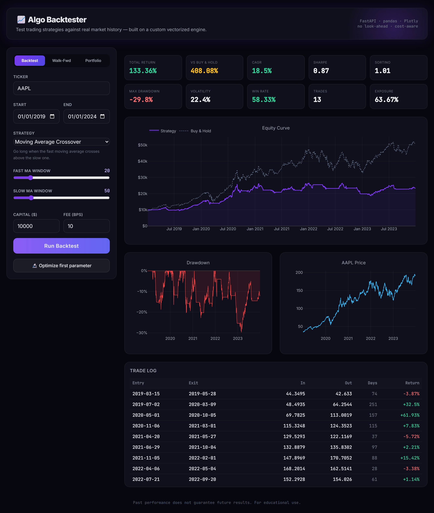
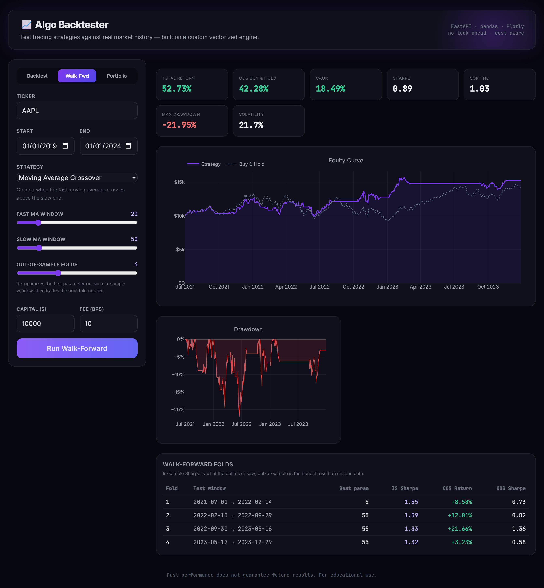
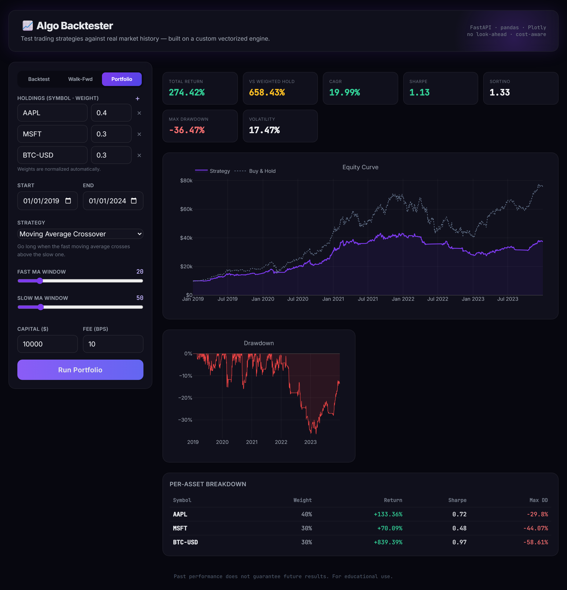

# 📈 Algo Backtester

A full-stack strategy backtesting platform. Test classic trading strategies
against real market history using a **custom vectorized backtest engine** — no
black-box backtesting library, so the logic is transparent and auditable.


### 🔗 [Live demo → algo-backtester.onrender.com](https://algo-backtester.onrender.com)

> Hosted on Render's free tier, so the first request after it's been idle may take
> ~30–60 seconds to spin up. Deploy your own copy with the button below.
>
> [](https://render.com/deploy?repo=https://github.com/Alissa-King/algo-backtester)



## Features

- **Three strategies** — Moving Average Crossover, RSI Mean Reversion, Bollinger Band Breakout
- **Custom engine** — vectorized in pandas/numpy with a realistic execution model:
  - No look-ahead bias (signals fill on the *next* bar)
  - Transaction costs charged on turnover (configurable bps)
  - Long/flat positioning
- **Real metrics** — Total Return, CAGR, Sharpe, Sortino, Max Drawdown, Volatility,
  Win Rate, Exposure, and a full round-trip trade log
- **Benchmark comparison** — every run is measured against buy-and-hold
- **Parameter optimization** — sweep a parameter and find the Sharpe-maximizing value
- **Walk-forward analysis** — anchored out-of-sample validation: the strategy is
  re-optimized on each in-sample window and traded on the next unseen fold, so you
  can see how much of the backtest edge survives on data the optimizer never saw
  (a direct check against overfitting)
- **Multi-asset portfolio mode** — run a strategy across several weighted symbols
  (equities + crypto), blend into a rebalanced portfolio, and compare against a
  weighted buy-and-hold benchmark with a per-asset breakdown
- **Polished UI** — responsive single-page dashboard with interactive Plotly charts
  and three analysis modes

## Architecture

```
algo-backtester/
├── backend/
│   ├── main.py              # FastAPI app + API routes, serves the frontend
│   ├── engine/
│   │   ├── data.py          # yfinance loader with in-process cache
│   │   ├── strategies.py    # signal generators + parameter specs
│   │   └── backtest.py      # vectorized engine + performance metrics
│   └── requirements.txt
└── frontend/
    └── index.html           # SPA (Tailwind + Plotly via CDN, no build step)
```

## Running locally

```bash
cd backend
python -m venv .venv
.venv\Scripts\activate          # Windows  (use: source .venv/bin/activate on macOS/Linux)
pip install -r requirements.txt
uvicorn main:app --reload --port 8000
```

Then open **http://localhost:8000**.

## API

| Endpoint | Method | Description |
|----------|--------|-------------|
| `/api/strategies`  | GET  | List strategies and their tunable parameters |
| `/api/backtest`    | POST | Run a single backtest, returns metrics + curves + trades |
| `/api/optimize`    | POST | Sweep one parameter, returns metric per value + best |
| `/api/walkforward` | POST | Anchored walk-forward; returns stitched OOS curve + per-fold results |
| `/api/portfolio`   | POST | Multi-asset portfolio backtest with per-asset breakdown |

## Screenshots

**Walk-forward analysis** — re-optimizes on each in-sample window and trades the
next fold unseen, exposing how much edge survives out-of-sample:



**Multi-asset portfolio** — a strategy run across weighted holdings, blended into a
rebalanced portfolio with a per-asset breakdown:



## Deployment (Render)

This repo ships a `render.yaml` blueprint, so it deploys to Render with no manual
config. To spin up your own instance:

1. Go to **[dashboard.render.com](https://dashboard.render.com)** → **New** → **Blueprint**.
2. Connect your fork of this repo. Render reads `render.yaml` and provisions a free web service.
3. Click **Apply**. The first build takes a few minutes; subsequent pushes auto-deploy.

The service binds to Render's `$PORT` and serves both the API and the frontend from
a single FastAPI process — no separate frontend host needed.

## Notes

Data is sourced from Yahoo Finance via `yfinance` (no API key required). Supports
equities (`AAPL`), crypto (`BTC-USD`), ETFs, and most Yahoo-listed symbols.

*Educational project. Past performance does not guarantee future results.*
